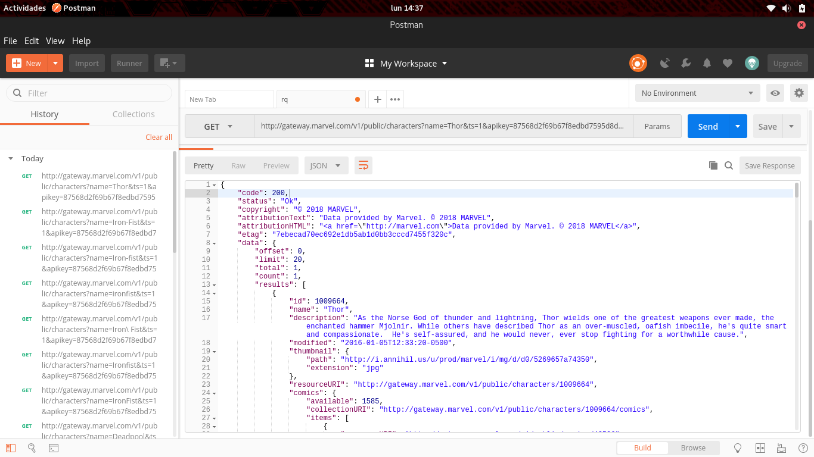
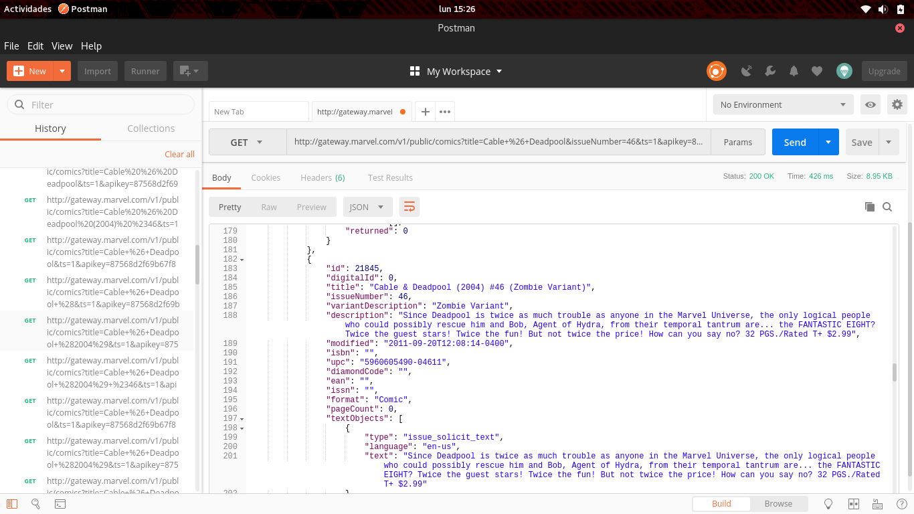
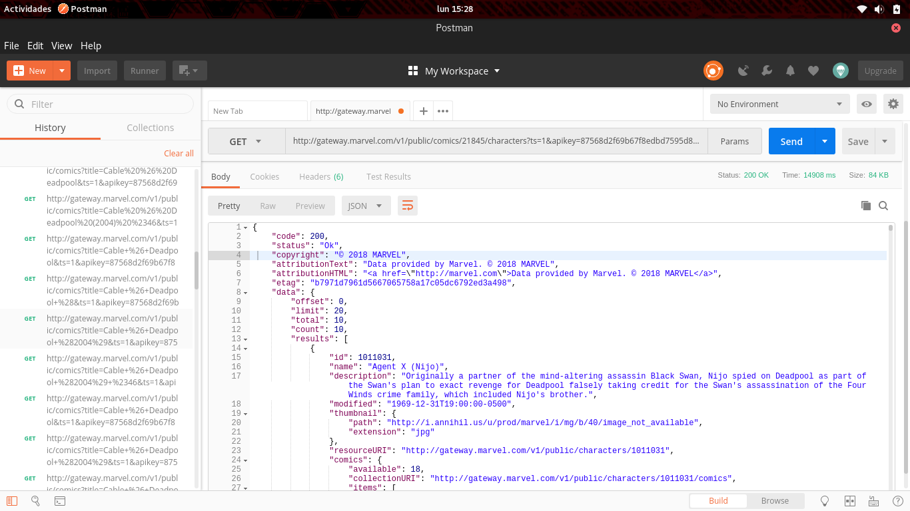
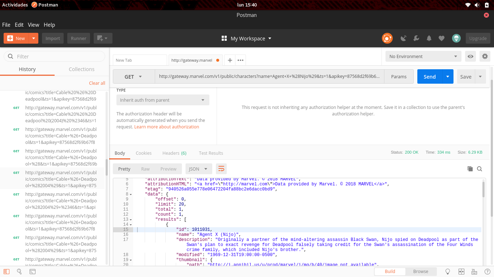
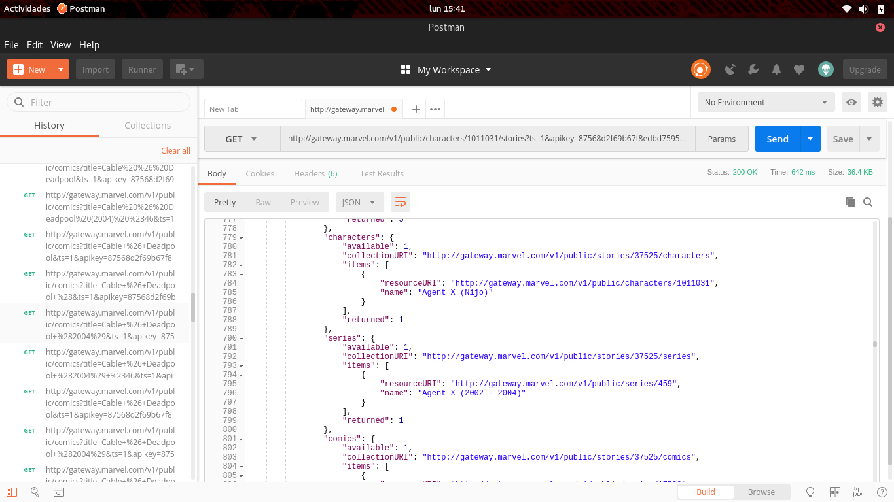

# Challenge 02
To make the queries to the API first I got a public and a private key from the website when I registered my account. The keys were needed to get authorization of the API. The following structure was used:

    http://gateway.marvel.com/v1/public/comics?ts=1&apikey=1234&hash=ffd275c5130566a2916217b101f26150

Where the parameters of **ts**, **keyapi** are a timestamp and the public key respectively. The **hash** parameter was a md5 created from the string (ts+private_key+public_key). I used i used:

    echo -n string_to_convert | md5sum

## 1st request: A superhero
To make the queries for some object I had to use the enpoints the API gives, these can be found [here](https://developer.marvel.com/docs#!/public/). To request for a specific hero I used, the base endpoint(http(s)://gateway.marvel.com/) plus the extension for the characters:

    http://gateway.marvel.com/v1/public/characters?name=Thor&ts=1&apikey=...&hash=...

In my case I passed the parameters for the name of the character(Thor) and then passed the ts, the public key and the hash mentioned above. Then I just make a GET request using Postman to that URL and get the json response (can be found [here](https://github.com/juliansibaja84/js-school/blob/master/week_02/C02/marvel_superHero.json)), next is an image showing the results:

## 2nd request: List of characters of Cable & Deadpool (2004) #46 Zombie Variant
To make this request I had to make 2 request, the first to find the ID of the comic an then another to get the characters from that comic. The endpoints and the parameters used to find the ID are are shown next:

    http://gateway.marvel.com/v1/public/comics?title=Cable+%26+Deadpool&issueNumber=46&ts=1&apikey=...&hash=...

There was needed to convert some special characters like the space and the "()". From the request response in json, I got the ID(21845), it can be seen in the following image:

Then I used the enpoint with the ID to find all the characters of that comic:

    http://gateway.marvel.com/v1/public/comics/21845/characters&ts=1&apikey=...&hash=...

The json response (can be found [here](https://github.com/juliansibaja84/js-school/blob/master/week_02/C02/cable_deadpool.json)), and the complete request can be seen here:

## 3nd request: List of all stories where Agent X (Nijo) appears
To make this request I had to make 2 request, the first to find the ID of the character an then another to get the stories of that character. The endpoints and the parameters used to find the ID are are shown next:

    http://gateway.marvel.com/v1/public/characters/?name=Agent+X+%28Nijo%29&ts=1&apikey=...&hash=...

From request response in json, I got the ID(1011031), it can be seen in the following image:

Then I used the enpoint with the ID to find all the stories of that character:

    http://gateway.marvel.com/v1/public/characters/1011031/stories&ts=1&apikey=...&hash=...

The json response (can be found [here](https://github.com/juliansibaja84/js-school/blob/master/week_02/C02/agent_x.json)), and the complete request can be seen here:

