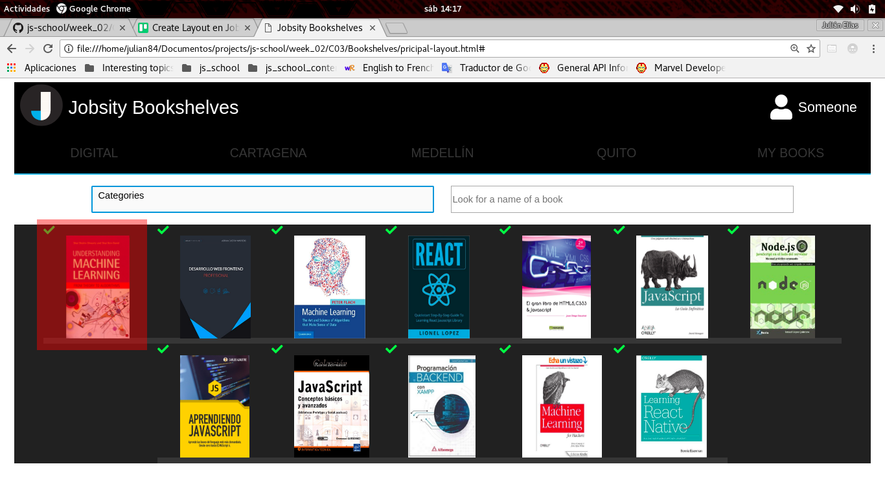
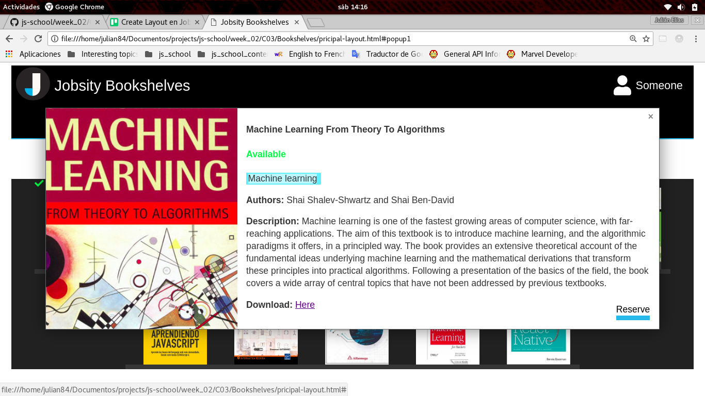

# Challenge 3

For this challenge  were made two layouts for a Bookshelves Application with just HTML and CSS. For this purpose was used Flexbox and Grid to organize the content of the pages, instead of a Framework. The layouts are in the Bookshelves folder with the names of _log-in-layout.html_ and _principal-layout.html_.

The principal layout is divided in two parts, a header and a page content. The header is used to select the bookshelf that the user wnats to explore, and the page content will show the selected bookshelf.

The books in the bookshelf have a tag over them that shows the state of the book, the tag can be green(available) and red(not-available).
When one book is clicked then the page will display a pop-up window with the description of the book. In the description can also be seen the state of the book, and a button to reserve the book.

In the mean time the principal layout only display the description for the first book, the one that is highlighted in red in the next image:

And when it is clicked, the following popup window is shown:

